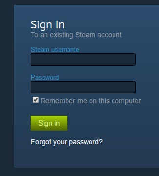
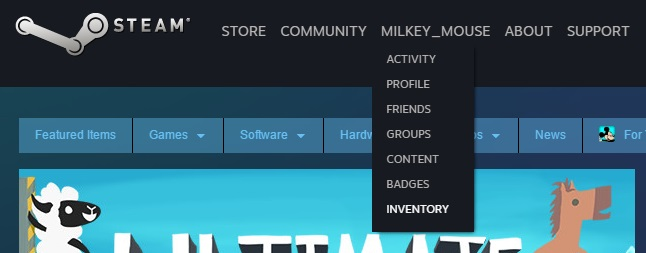
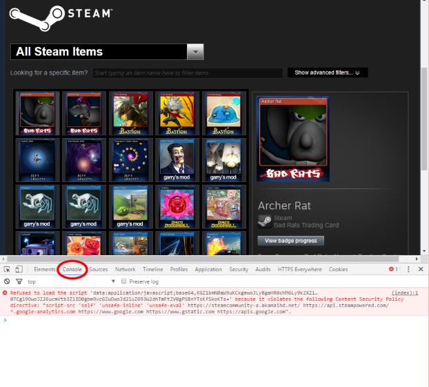

# Steam Bulk Seller (Русифицированная версия)

Если вы, как и я, не особо увлекаетесь коллекционированием Steam Trading Cards (например, ради кастомных эмодзи), то можете просто продать свои карточки. Каждая из них стоит около 10 центов. Если в вашем инвентаре есть сотни карточек, это может принести вам достаточно средств (в виде кредитов Steam), чтобы купить пару недорогих игр.

Этот небольшой JavaScript-скрипт автоматически продаёт все карточки Steam из вашего инвентаря. В оригинальной версии скрипт выставляет карточки на продажу по медианной цене за последние 10 дней.

**Эта модифицированная и русифицированная версия позволяет:**
- Работать с русским интерфейсом Steam.
- Использовать актуальные цены за последние 10 дней.
- Управлять процессом продажи через удобный интерфейс (UI), добавленный в правом нижнем углу страницы.
- Настраивать задержку между продажами.
- Запускать и останавливать процесс продажи в любой момент.
- Пропускать фольгированные карточки при необходимости.

## Как пользоваться

1. Войдите в свой аккаунт на [сайте Steam](https://steamcommunity.com/login):

    

2. Перейдите в свой инвентарь:

    

3. На странице инвентаря **убедитесь**, что в опциях **«Показать доп. фильтры»** выбрана **«Коллекционные карточки»**:

    

4. Вставьте скрипт в консоль браузера.

### Вставка скрипта в консоль
- Откройте консоль разработчика: нажмите `Ctrl-Shift-I` (или `Cmd-Alt-I` на Mac), а затем перейдите на вкладку «Консоль». Это работает в большинстве браузеров. Пример для Chrome:

    

- Вставьте содержимое модифицированного скрипта в консоль и нажмите Enter.
- На странице появится небольшой интерфейс в левом нижнем углу. Используйте кнопки «Начать» и «Остановить», чтобы управлять процессом продажи.

### Основной функционал
- Скрипт фильтрует только продаваемые предметы (например, карточки).
- Продаёт предметы по актуальной средней цене за последние 24 часа (с учётом русского интерфейса Steam).
- Даёт возможность задать задержку между выставлением лотов.
- Позволяет установить минимальную и максимальную цену для продажи.
- Добавляет процент надбавки к цене продажи.
- Пропускает фольгированные карточки, если это необходимо.
- Работает пошагово, что позволяет остановить процесс в любой момент.

### Настройки интерфейса
Интерфейс продажи предоставляет следующие настройки:
- **Задержка (мс):** Время между выставлением каждой карточки.
- **Случайная задержка + (мс):** Дополнительная случайная задержка для избегания подозрительной активности.
- **Макс. кол-во карт:** Максимальное количество карточек для продажи (0 — без ограничений).
- **Мин. цена (копейки):** Минимальная цена продажи карточки.
- **Макс. цена (копейки):** Максимальная цена продажи карточки.
- **Надбавка (%) к цене:** Процент надбавки к вычисленной цене.
- **Пропускать фольгу:** Опция для пропуска фольгированных карточек при продаже.

## Оригинальный автор
Этот скрипт является русифицированной и модифицированной версией работы [Milkey Mouse](https://github.com/milkey-mouse). Оригинальный скрипт можно найти [здесь](https://milkey-mouse.github.io/SteamBulkSeller/).

Если хотите использовать оригинальную версию, ознакомьтесь с [инструкцией на странице оригинального проекта](https://milkey-mouse.github.io/SteamBulkSeller/).

---

**ОТКАЗ ОТ ОТВЕТСТВЕННОСТИ:** Я, как модификатор и русификатор, не несу ответственности за любые последствия, связанные с использованием этого скрипта. Вы используете его на свой страх и риск.

**Примечание:** Этот скрипт работает только на странице инвентаря Steam.